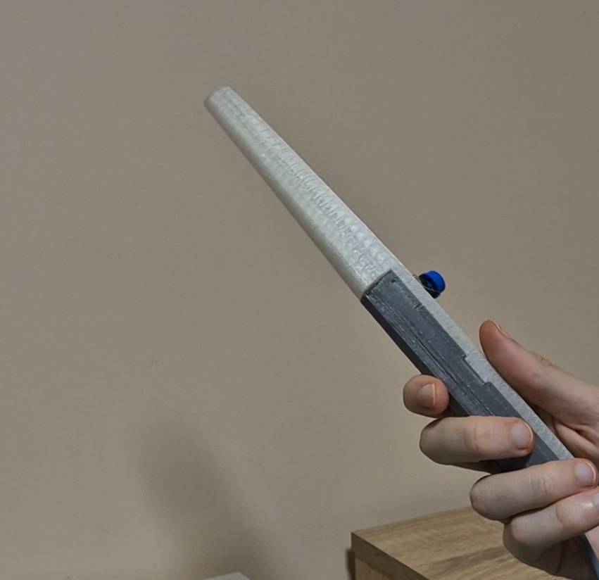
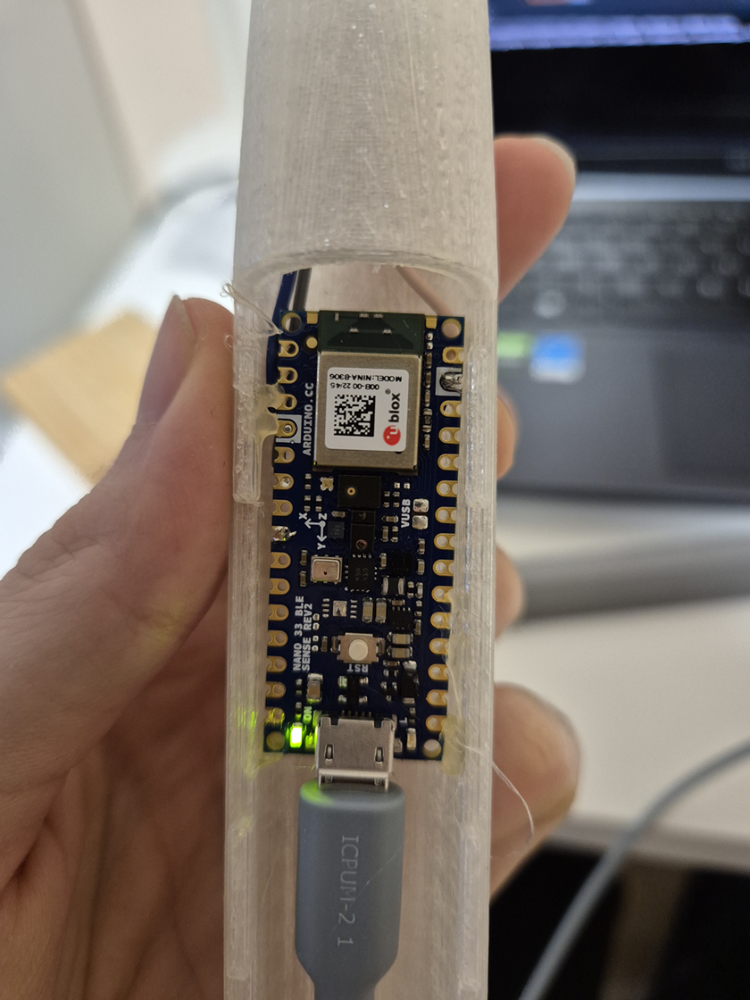

# MagicWand
## Overview
The Magic Wand is an interactive device capable of recognizing spells based on motion patterns. By using an Inertial Measurement Unit (IMU), the wand detects gestures and classifies them into predefined spells. Wave the wand in different shapes—like circles, slashes, or spirals—to cast spells and see the magic in action! \
Hardware: Arduino Nano 33 BLE Sense Rev2

## Files
DataCollect.ino - arduino code for gathering data \
DataCollect.py - python code for reading Serial Monitor and saving it into csv files \
bluetooth.py - bluetooth server responsible for receiving the spell name \
ML.ipynb - main jupyter notebook for training and exporting tinyML model
